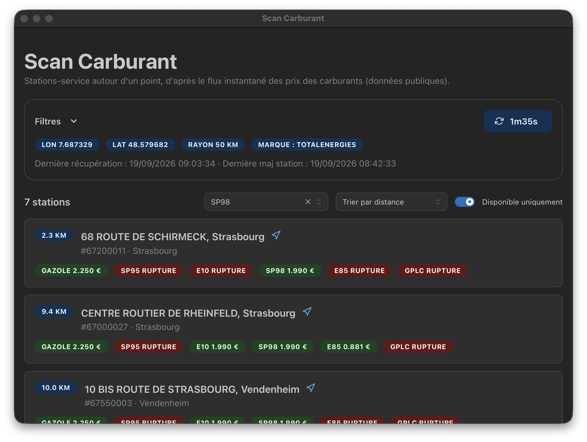

# Scan Carburant



A lightweight desktop app for finding fuel stations around a point, built with
[Tauri v2](https://tauri.app) (Rust core) + [Vite](https://vite.dev) + React +
[Mantine](https://mantine.dev).

The Rust core owns polling, the ODS/Overpass adapters, the edge detector,
filtering, sorting, persistence, the tray, and OS notifications. The webview is
a thin UI over it and talks to Rust through Tauri commands. There is no Deno
runtime and no bundled browser engine (system webview: WKWebView on macOS,
WebView2 on Windows, WebKitGTK on Linux).

See
[docs/adr/0002-tauri-migration.md](docs/adr/0002-tauri-migration.md) for the
migration decision and
[docs/adr/0001-watcher-architecture.md](docs/adr/0001-watcher-architecture.md)
for the watcher architecture.

## How it works

- The Rust poller fetches the open fuel-price feed (ODS Explore v2.1) around the
  selected point, normalizes it, and runs the `rupture → available` edge
  detector. Polling and notifications keep running with the window closed.
- Brand names are not in the feed, so they are resolved from OpenStreetMap
  (Overpass), matched to feed stations by proximity, and cached for an hour.
- The UI calls Tauri commands (`get_state`, `update_filters`, `get_results`,
  `refresh`, `get_brands`, `notification_permission`); `get_results` returns
  stations already filtered and sorted by Rust using the current filters.

## Requirements

- [Node.js](https://nodejs.org) 20 or newer (npm).
- [Rust](https://www.rust-lang.org/tools/install) stable.
- The platform prerequisites for Tauri v2 (see
  <https://tauri.app/start/prerequisites/>). On Linux that includes
  `libwebkit2gtk-4.1-dev`, `libappindicator3-dev`, `librsvg2-dev`, and
  `patchelf`.

## Development

```sh
npm install
npm run tauri dev   # Vite dev server + Rust core with hot reload
```

`npm run tauri dev` starts Vite (`beforeDevCommand: npm run dev`) and opens the
native window with the Rust core attached. Plain `npm run dev` only serves the
UI in a browser — there is no browser fallback, so the app needs the Tauri core.

The Rust core starts the poll loop and the tray as soon as the app launches, so
alerts keep firing with the window closed. Closing the window hides it; quit via
the tray or the app menu.

## Build a native app

```sh
npm run tauri build
```

Tauri produces platform installers (`.dmg` / `.app` on macOS, `.msi` / NSIS on
Windows, `.AppImage` / `.deb` on Linux) under `src-tauri/target/release/bundle/`.

On macOS the DMG step runs an AppleScript against Finder to lay out the disk
image window. If that is blocked locally (`Not authorized to send Apple events
to Finder`), run with `CI=true` so Tauri skips the cosmetic AppleScript:
`CI=true npm run tauri build`. CI runners set `CI` automatically.

## Quality checks

| Command             | Scope                                                |
| ------------------- | ---------------------------------------------------- |
| `npm run lint`      | `oxlint` over the frontend                           |
| `npm run fmt`       | `oxfmt --check` (use `npm run fmt:write` to fix)     |
| `npm run typecheck` | `tsc --noEmit`                                       |
| `npm test`          | Vitest (`vitest run`, `npm run test:watch` to watch) |
| `cargo test`        | Rust core tests (run from `src-tauri/`)              |

The Rust suites in `src-tauri/src/**` are the behavioral oracle ported from the
former TypeScript watcher; `cargo test` is the primary test target.

## Layout

| Path                        | Purpose                                                 |
| --------------------------- | ------------------------------------------------------- |
| `index.html`                | Vite entry document                                     |
| `src/main.tsx`              | React root, Mantine provider                            |
| `src/App.tsx`               | UI; reads/writes state through Tauri commands           |
| `src/types.ts`              | Frontend mirror of the Rust wire types                  |
| `src/state/client.ts`       | Typed `invoke` wrappers over the Tauri commands         |
| `src/filters/store.ts`      | localStorage cache of the form state                    |
| `src/brands/store.ts`       | localStorage cache of the brand directory               |
| `src-tauri/`                | Rust core, Tauri config, capabilities, and icons        |
| `src-tauri/src/domain/`     | Model, geo/haversine, edge detector, fuel filter        |
| `src-tauri/src/ingest/`     | Raw records and normalization (Europe/Paris timestamps) |
| `src-tauri/src/feed/`       | ODS Explore v2.1 feed client                            |
| `src-tauri/src/brands/`     | Brand directory build/match/merge + Overpass client     |
| `src-tauri/src/http.rs`     | Circuit breaker, retry, and `Retry-After` handling      |
| `src-tauri/src/poller.rs`   | Poll loop, brand refresh, notifications                 |
| `src-tauri/src/commands.rs` | Tauri commands consumed by the UI                       |
| `src-tauri/src/tray.rs`     | Tray icon, window lifecycle                             |
| `src-tauri/src/menu.rs`     | Application menu and menu events                        |
| `postcss.config.cjs`        | Mantine's PostCSS preset                                |

## Notes

- The frontend does not poll or filter itself; `get_results` returns stations
  already filtered and sorted by Rust using the current filters.
- The ODS feed labels French local wall-clock timestamps as UTC; the normalizer
  reinterprets them as `Europe/Paris` (see `src-tauri/src/ingest/normalizer.rs`).
- The brand refresh uses several public Overpass instances and retries on
  `429`/`5xx`, honoring the `Retry-After` header. It runs in the background so a
  slow or rate-limited Overpass never delays the fuel results.
- Tauri desktop notifications do not expose click events or a `tag` dedupe
  field, so the old "click to focus + open Google Maps" behavior is not
  reproduced; see the ADR's Consequences section.
